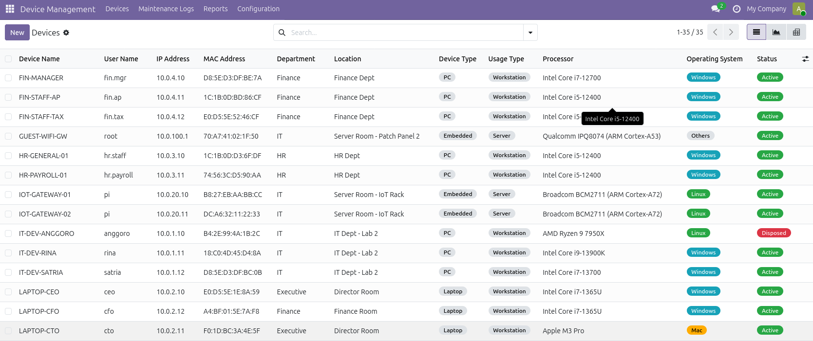
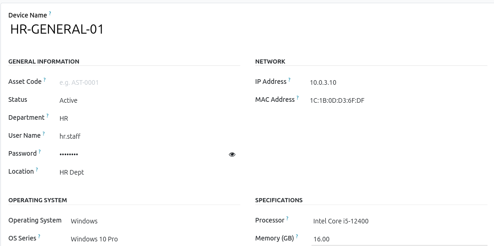

# Device Management

**Language:** [🇬🇧 English](README.md) | [🇮🇩 Indonesia](README-id.md)

Odoo 19 addon for IT company device inventory and management (PC, Laptop, Server, Embedded Device).

Part of the [odoo-boilerplate](https://github.com/luridarmawan/odoo-boilerplate) project for Odoo 19.

## Screenshots

| Dashboard | Device Detail |
|-----------|---------------|
|  |  |

## Features

- **Device Master Data**: Records name, department, user, IP, MAC, OS, serial number, device type, and location.
- **Device Log**: Records maintenance, repair, upgrade, and troubleshooting history.
- **One-click Remote Access**: SSH, RustDesk, and VNC support via Custom URL Protocol.
- **Multi Language**: English (en_US) and Indonesian (id_ID).
- **Security Groups**: Device User (read-only), Device Manager (CRUD), Device Administrator (full access).

## Multi Language

This module supports two languages:

| Language         | Locale | File              |
|------------------|--------|-------------------|
| English          | en_US  | `i18n/en.po`      |
| Indonesian       | id_ID  | `i18n/id.po`      |

Language is automatically detected from the user's Odoo language preference.

## Installation

### Traditional Installation

1. Copy this folder to your Odoo addons directory:

```bash
cp -r device_management /path/to/odoo/addons/
```

2. Restart Odoo service:

```bash
sudo systemctl restart odoo
# or
sudo service odoo restart
```

3. Open Odoo, enable *Developer Mode* (Settings → Activate Developer Mode).

4. Go to **Apps → Update Apps List**.

5. Search for **Device Management**, then click **Install**.

### Alternative via Git Clone

```bash
cd /path/to/odoo/addons
git clone <repo-url> device_management
```

Proceed to steps 2-5 above.

### Docker Installation

If you are using the [odoo-boilerplate](https://github.com/luridarmawan/odoo-boilerplate) with Docker:

1. Clone this repository into the `addons/` directory:

```bash
cd /path/to/odoo-boilerplate/addons
git clone <repo-url> device_management
```

2. Restart the Docker containers:

```bash
docker compose restart
```

3. Open Odoo, enable *Developer Mode* (Settings → Activate Developer Mode).

4. Go to **Apps → Update Apps List**.

5. Search for **Device Management**, then click **Install**.
